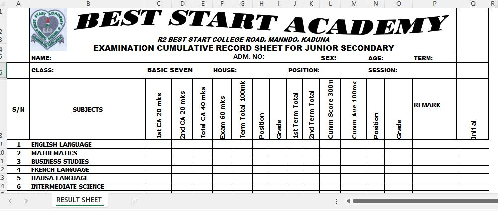
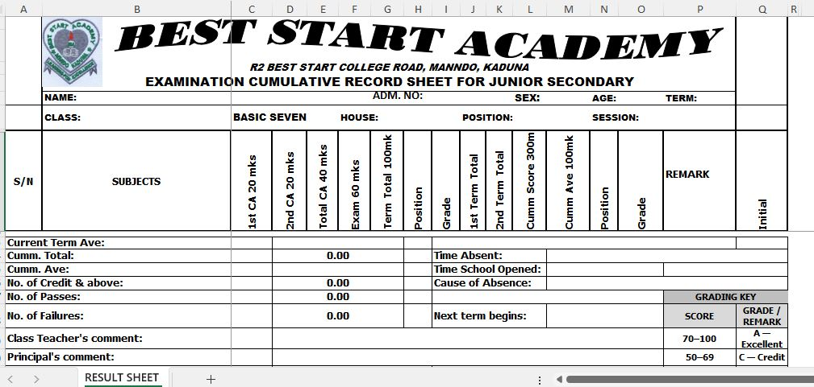
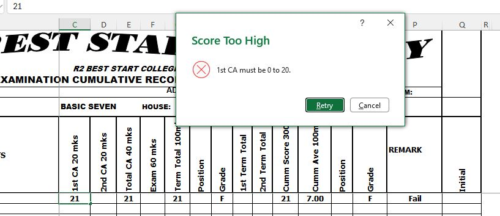
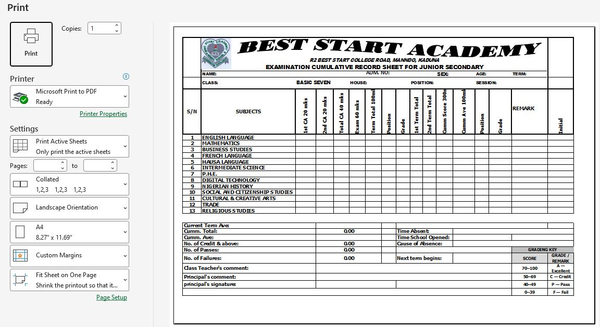
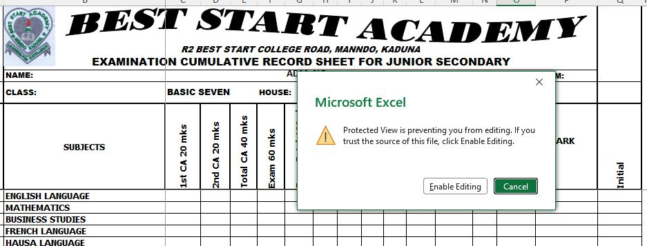

# School Result Management System

## Overview

This project is a Microsoft Excel Result Management System developed for a secondary school.

It was designed to make result preparation easier, improve accuracy, and reduce manual calculation errors while maintaining data integrity.

The workbook allows teachers to enter Continuous Assessment (CA) and Examination scores while automatically calculating totals, grades, remarks, averages, and cumulative results.

## Features

- Manual entry of Continuous Assessment (CA) and Examination scores
- Automatic calculation of:
  - Total Score
  - Grade
  - Remark
  - Average Score
  - Cumulative Result
- Data Validation to prevent invalid score entry
- Custom error messages for invalid scores
- Password-protected worksheets to prevent accidental modification of formulas
- One worksheet per student
- Professional A4 landscape print-ready result sheet
- Structured layout for easy result processing

## Microsoft Excel Functions and Features Used

### Functions

- IF
- SUM
- AVERAGE
- COUNTIF
- ROUND

### Excel Features

- Data Validation
- Worksheet Protection
- Formula Automation
- Cell Protection
- Print Area
- Page Setup
- Conditional Logic

## Skills Demonstrated

- Microsoft Excel
- Advanced Excel Formula Design
- Spreadsheet Automation
- Data Validation
- Worksheet Protection
- Result Processing
- Data Integrity
- Report Design
- Print Layout Optimization
- Problem Solving

## Technical Details

This workbook was developed using Microsoft Excel to improve result preparation and reduce manual calculation errors.

Key technical features include:

- Automated calculation of total scores
- Automatic grade generation using IF functions
- Automatic remark generation
- Average score calculation
- Cumulative result calculation
- Data Validation to restrict invalid score entry
- Protected formulas to prevent accidental modification
- Print layout configured for A4 landscape printing

# Project Screenshots

## 1. Result Sheet

The main result sheet used for entering student scores.

## 2. Result Layout

Professional layout showing the complete examination result sheet.

## 3. Data Validation

The workbook prevents users from entering scores outside the approved range.

If an invalid score is entered, an error message is displayed and the user must correct it before continuing.

## 4. Print Preview

The workbook is designed to fit neatly on a single A4 landscape page for professional printing.

## 5. Worksheet Protection

Important formulas and protected cells cannot be modified accidentally, helping maintain data integrity during result preparation.

## Benefits

This workbook helps schools to:

- Reduce manual calculation errors
- Improve accuracy
- Maintain data integrity
- Prepare results faster
- Produce professional printed result sheets
- Protect important formulas from accidental editing

## Future Improvements

Future versions may include:

- Automatic class position calculation
- Student database integration
- School fee management
- Performance dashboard
- Multi-user support
- Computer-Based Test (CBT) integration

## Author

**ANNY ETIM**

GitHub: https://github.com/AniediEtim
